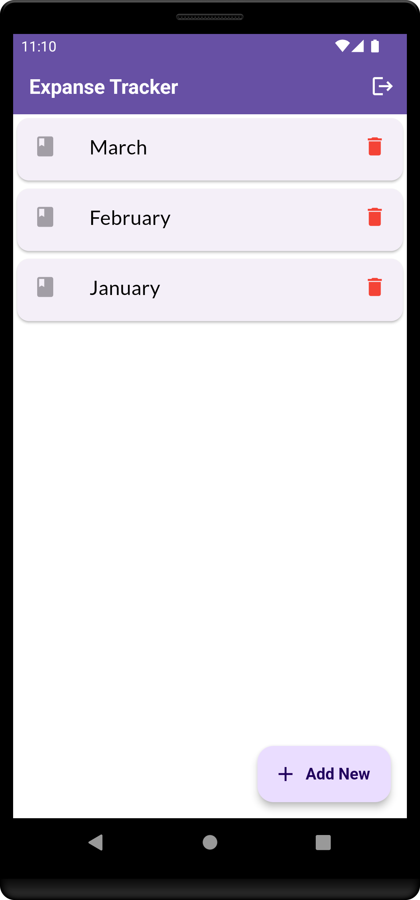
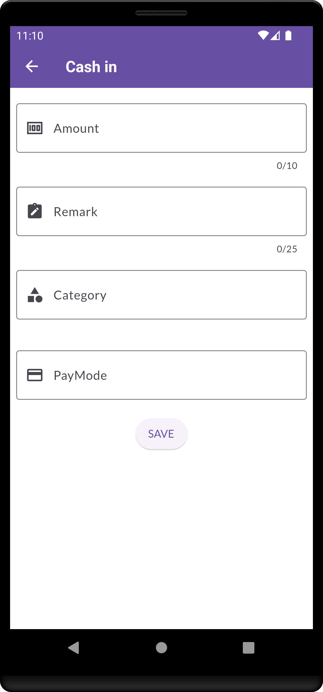
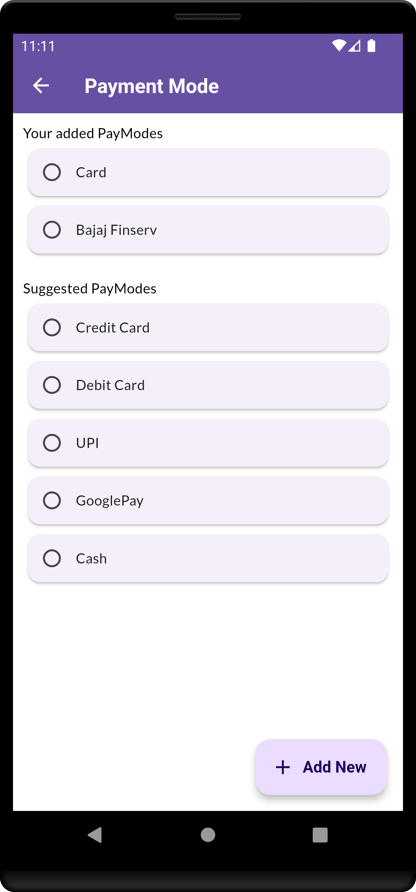

# Expanse Tracker

Add daily expanse entries, create ledgers and know your account balance. Expanse Tracker is simple cash management and bookkeeping app for all kind of business.

# Screenshots
<table>
  <tr>
     <td>Login Screen</td>
     <td>OTP Screen</td>
     <td>Home Screen</td>
     <td>Entries Screen</td>
  </tr>
  <tr>
  <td></td>
  <td></td>
  <td></td>
  <td> </td>
  </tr>
 </table>
 
 <table>
  <tr>
     <td>Entries Form Screen</td>
     <td>Category Screen</td>
     <td>Paymode Screen</td>
  </tr>
  <tr>
  <td>  </td>
  <td></td>
  <td></td>
  </tr>
 </table>
 
 
# App Flow Chart

# Firestore Database Design

 
# Third party libraries used,
1. Google Fonts (https://pub.dev/packages/google_fonts)
2. Cloud Firestore (https://pub.dev/packages/cloud_firestore)
3. Firebase Core (https://pub.dev/packages/firebase_core)
4. Firebase Phone Auth (https://pub.dev/packages/firebase_auth)
5. Pinput (https://pub.dev/packages/pinput)
6. Date format Intl (https://pub.dev/packages/intl)
7. Provider (https://pub.dev/packages/provider)
8. Toast Message (https://pub.dev/packages/fluttertoast)

# Firebase Firestore Database:
https://www.youtube.com/watch?v=wUSkeTaBonA

https://firebase.google.com/codelabs/firebase-get-to-know-flutter#0

# Firebase Phone Auth:
https://www.youtube.com/watch?v=PEUUYOQ2Ixo&t=143s

https://github.com/Amanullahgit/flutter_phone_authentication

# What’s Next
1. Light and Dark Theme
2. Error Handling
3. Adaptive UI Design (To support platform independent component)
4. MediaQuery (To adjust the components based on device screen)
5. Test case creation
6. Implement user defined auto reminder
7. Optimise the read/write queries to avoid unnecessary service calls
8. To collect user feedback

# Resources
Installation: https://docs.flutter.dev/get-started/install

CodeLabs: https://docs.flutter.dev/codelabs

Packages/Libraries: https://pub.dev

Youtube: https://www.youtube.com/@flutterdev/videos

